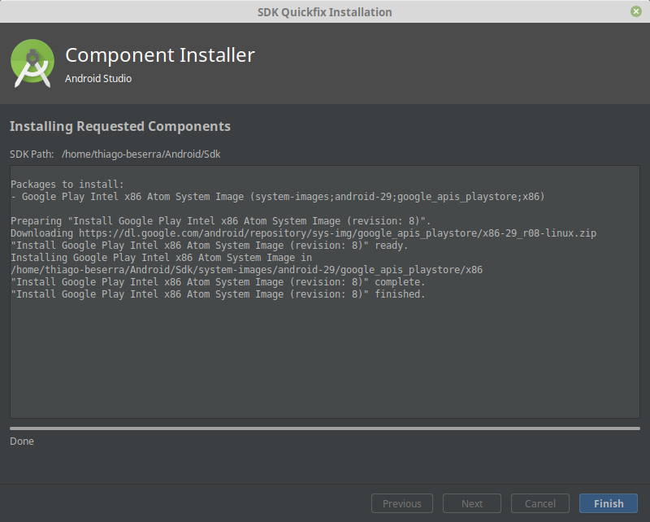
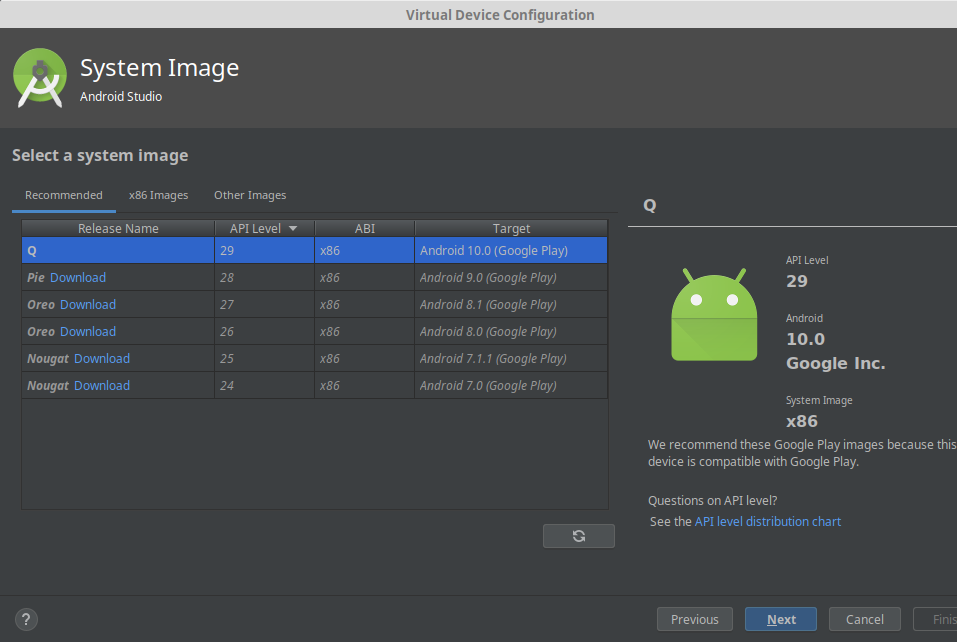
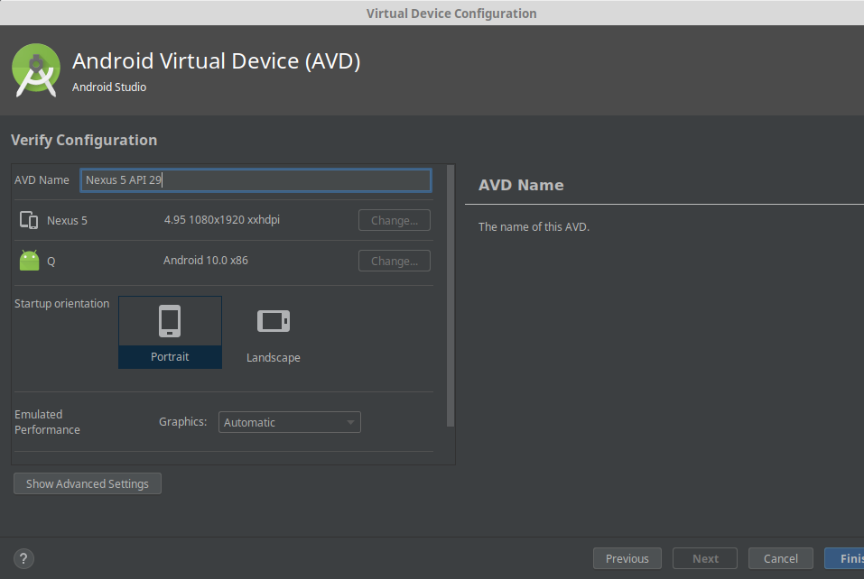
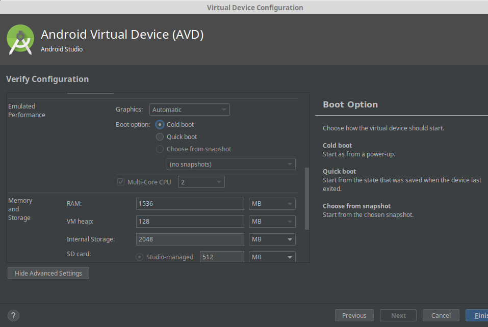

# weather-climate
App that show the weather's climate around fifity distance by device's current location

## Project Environment
- OS: Linux Mint v.19 Tara 64 bits   https://linuxmint.com/download.php
- ENVIRONMENT DEVELOPMENT: Android Studio v3.5.3   https://developer.android.com/studio?hl=pt-br
- FRAMEWORK DEVELOPMENT: SDK v29 (API 29.0.2: Android 10.0 Q), SDK min. v15 (API 15: Android 4.0.3 IceCreamSandwich), Language: Kotlin v1.3.61
- VIRTUAL DEVICE ANDROID STUDIO PHONE: Pixel size: 5.0, Resolution: 1080x1920px, Density: 420dpi, Startup orientation: portrait
-
## Import and execute the Project in Android Studio
1 - Clone the weather-climate project into your repository folder:

```sh
$ git clone https://github.com/thibeserra/weather-climate.git
```

2 - Open Android Studio IDE and import the cloned project:


- Go to your repository folder and choose the weather-climate project


- IDE will download the dependencies project and build it. Await this steps:


3 - Let's create a virtual device to start the project
 - Click on AVD MANAGER icon in the right top IDE:
 

 - After open AVD MANAGER'S view, click on button CREATE VIRTUAL DEVICE:
 

 - Choose in menu CATEGORY, the PHONE option. After, choose Nexus 5X virtual device and click in NEXT button:
 

 - In RECOMMENDED tab, download the image API Level 29, ABI x86, Target Android 10.0 (Google Play):
  

  - After, wait the process download. This can take a long time, depending on the speed of your network:
  

  - when the downlaod finish and unnzip the image, click on FINISH button:
  

  - Then, in SYSTEM IMAGE view, click on NEXT button:
  

  - The next step is configure the virtual-device. In AVD NAME, show the device name or keep the default:
  

  - On the same view, click on SHOW ADVANCED SETTINGS button and check the BOOT OPTION='Cold boot' and click in FINISH button:
  

  - At this moment, the virtual devid is created:
  

